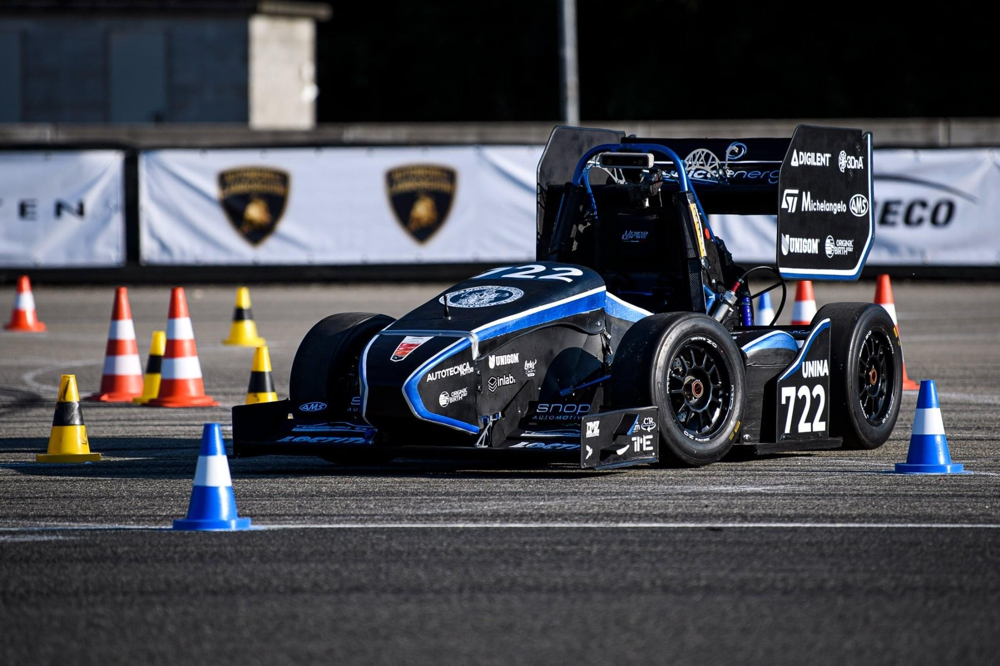
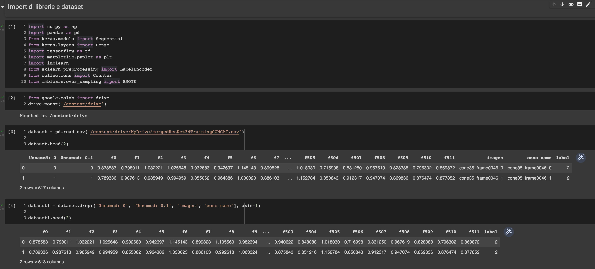
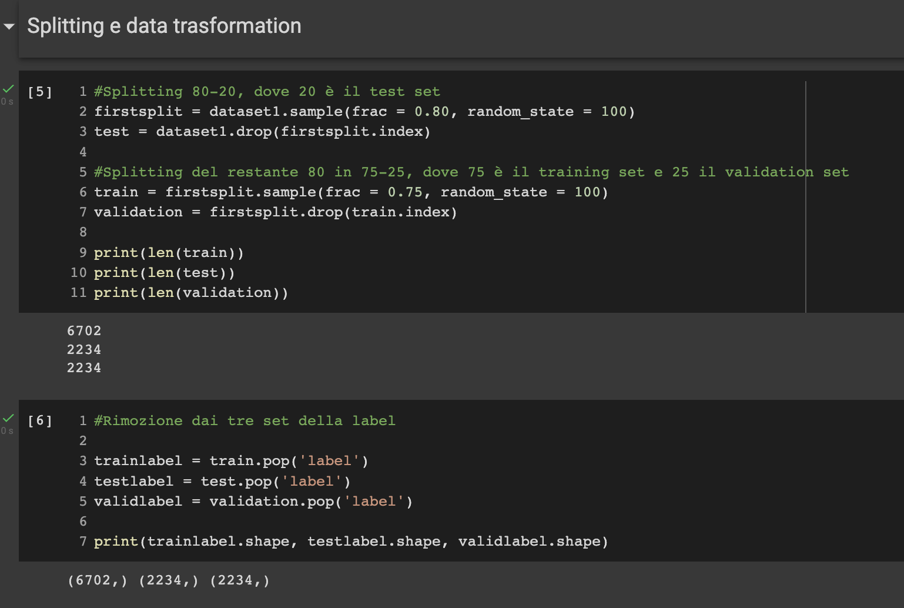
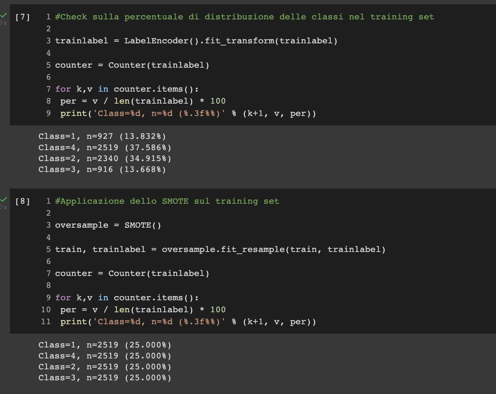
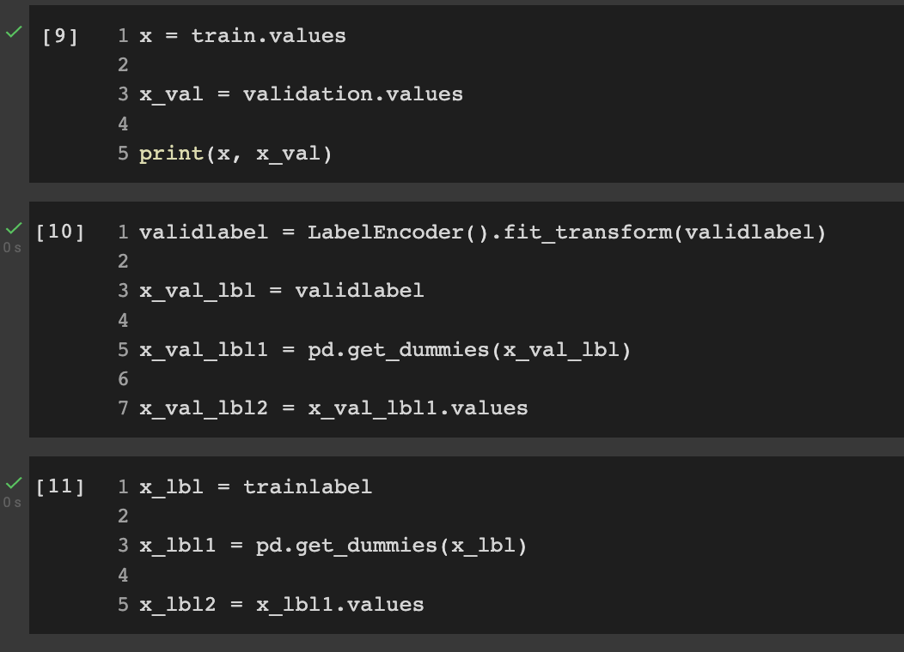
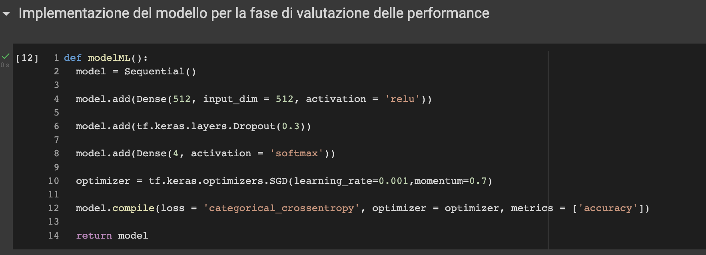
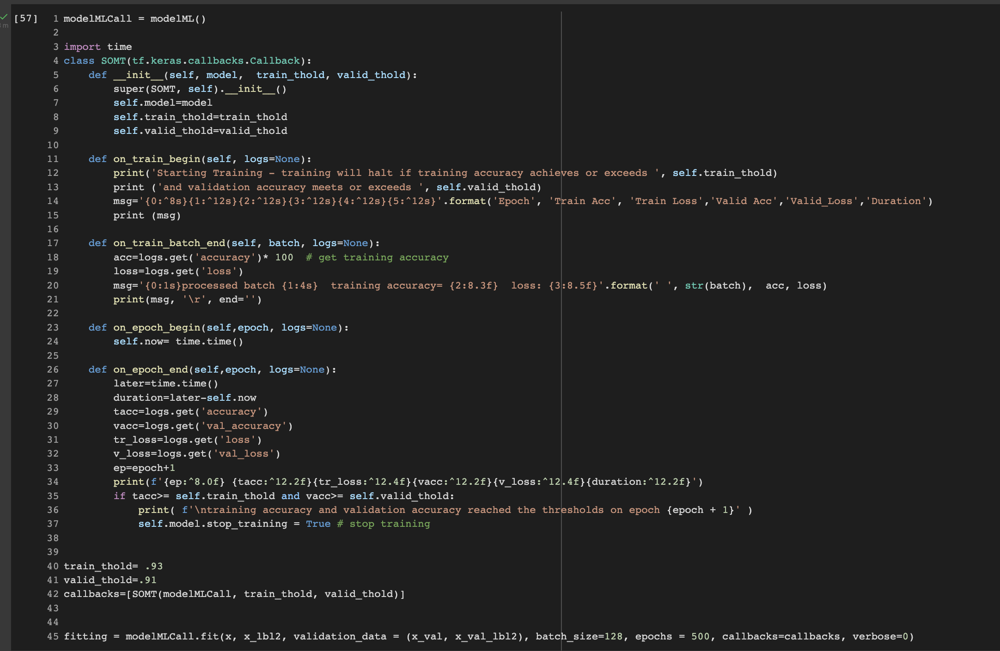

# formulaSAE-track-cones-classification

This project was developed for the *Machine Learning* course as part of my academic work as a master's degree student in Computer Engineering.

The assignment and the data were hosted on the Kaggle platform as a competition, owned by the University of Napoli "Federico II".

> *Important note about the data*: The dataset used in this project was provided through a private Kaggle competition hosted by the aforementioned university. Due to the competition's intellectual property rules, the data is not included in this repository.

# Project Overview

## The dataset

The dataset consists of features extracted from various frames of videos depicting different types of cones used in Formula SAE races.
These types are:
  - Big orange cones, delimiting the beginning and ending of the track 
  - Little orange cones, delimiting the finish area
  - Blue cones, delimiting the right border of the track
  - Yellow cones, delimiting the left border of the track

The aim of this project is to properly classify a specific cone detected by sensors given its extracted features.
A label is assigned to each type of cone, going from 1 to 4.

The datasets to train and test the model on are in the **csv** format.

## Model implementation

### Libraries and first operations

In the following picture 3 blocks can be seen and they show, respectively, all the libraries used, the loading of the dataset through *pandas* and the drop of columns that won't be used.
Also, the first two rows of the csv file can be seen, which give an idea of how the dataset is structured.

Next, the dataset was split in training set, validation set and test set, following a **80 (75-25) - 20** rule, meaning that 80% of the training set got split into 75%-25%.

A class imbalance was noticed. In particular, **class 1** only had **927 samples** and **class 3** only had **916**. Thus, the SMOTE technique was used to oversample the minority classes.

### Training procedure

Before training the model, both input features and target labels needed to be converted into a format compatible with Keras.

The pipeline that performs the aforementioned operations is the following:

  - The training and validation Pandas dataframes got coverted into NumPy arrays because Keras expects inputs as arrays;
  - Encoding of the validation labels into integers via LabelEncoder;
  - Application of one-hot encoding through get_dummies. This produces a NumPy array, needed for training with the categorical_crossentropy loss function;
  - Application of the same encoding to the training labels.

### Model definition

The neural network used is a simple feedforward model, with the following features:

  - One hidden layer;
  - One dense hidden layer with 512 neurons and ReLU activation;
  - Dropout layer (0.3) to prevent overfitting;
  - Output layer with 4 neurons and softmax activation, suitable for multiclass classification;
  - categorical_crossentropy as loss function, which works with one-hot encoded labels;
  - Stochastic Gradient Descent with momentum as optimizer.

Then, a custom callback SOMT was used, to intervene at different stages of the training process. In particular, the one shown is used to automatically stop training once the model reaches a desired training and validation accuracy.

The training would stop once the train and val thresholds would, respectively, go above **93%** and **91%**

